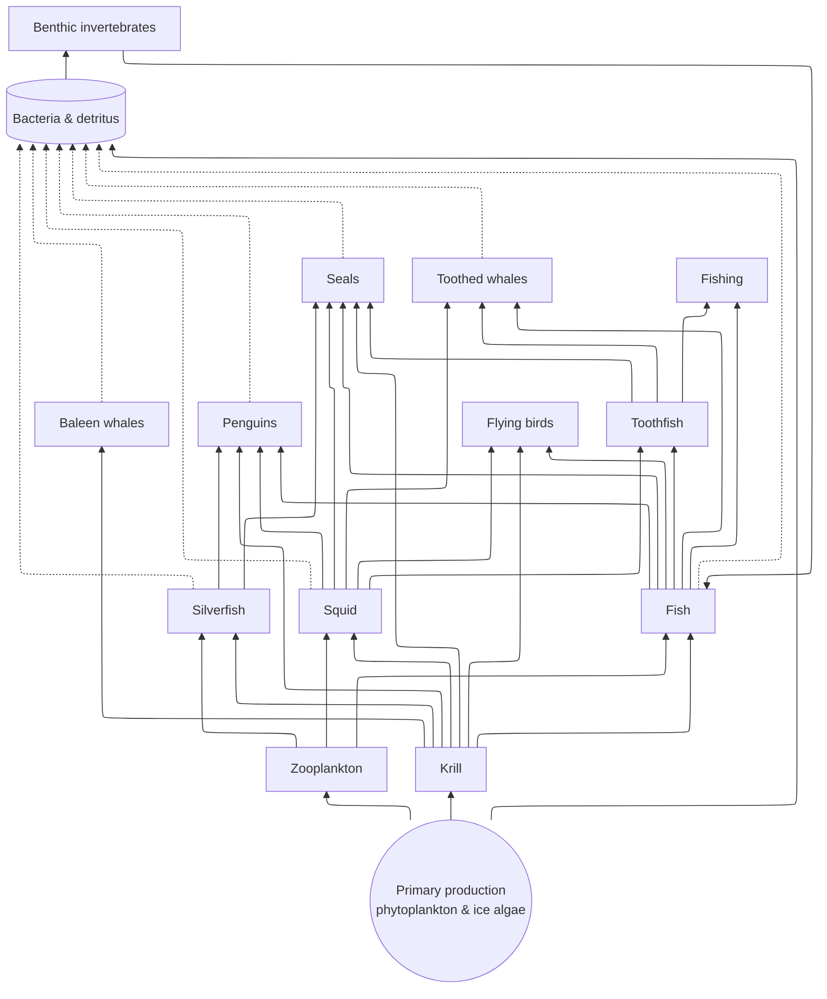

# Ross Sea Food Web Quiz

This is a flash card game based on the NZ [The food web in the Ross Sea](https://www.sciencelearn.org.nz/images/the-food-web-in-the-ross-sea?utm_source=perplexity&utm_source=perplexity)



🎮 **[Play the game online!](https://simbo1905.github.io/ross-sea-food-web/)**

## Features

- Serverless - runs as a single HTML file
- Separates knowledge base (JSON) from game engine
- Compatible with Chrome OS, macOS, Windows, and mobile devices
- Minimal dependencies, modern web standards

## Project Structure

```
/
├── index.html          # Main game interface
├── js/
│   ├── game-engine.js  # Core game logic
│   └── ui.js           # User interface handlers
├── data/
│   ├── schema.json     # JSON schema for knowledge base
│   └── questions_*.json# Game questions and answers
├── css/
│   └── style.css       # Basic styling
└── templates/
    └── index.hbs       # Handlebars template used by the bundler
```

## Development

This project uses [Just](https://github.com/casey/just) as its command runner and small Rust tools for validation, bundling, and testing. No Python is required.

### Prerequisites

- [Just](https://github.com/casey/just#installation)

### Quick Start

```bash
# 1) Download platform tools into .tools (from GitHub Releases)
just setup

# 2) Clean, build, and test
just clean
just build     # Validates data and generates index.html
just test      # Runs the Rust browser tests

# Optional
just validate  # Validate JSON files against schema
```

### Available Commands

```bash
just           # List commands
just setup     # Download platform-specific tools into .tools (from releases)
just clean     # Remove generated files
just build     # Validate JSON and bundle assets into index.html
just validate  # Validate JSON files against schema
just test      # Run browser tests via Rust test-runner
```

## Build and Test Workflow

The build process validates JSON files and bundles all resources (CSS, JS, JSON) into a single `index.html` file:

```bash
just build     # Validates and bundles
```

The tools are:
- `validate` - Validates JSON question files against the schema
- `bundle` - Bundles resources into a single HTML file using Handlebars templating

Run tests:

```bash
just test      # Runs the Rust test-runner against index.html
```

## Usage

Open `index.html` in any modern web browser, or play online at https://simbo1905.github.io/ross-sea-food-web/

## Continuous Integration & Deployment

This project uses GitHub Actions to automatically build and deploy to GitHub Pages:

- On every push to `main`, the app is built and deployed to GitHub Pages
- Pull requests trigger builds to ensure changes are valid
- The deployment includes automatic testing to verify the page is accessible

The CI workflow:
1. Downloads pre-built tools
2. Validates JSON files against schema
3. Builds the single-file HTML application
4. Deploys to GitHub Pages (main branch only)
5. Tests the deployment with curl to ensure it's accessible

## Contributing (Tools Development)

If you need to develop the tools themselves, use:

```bash
just tools:build           # Build Rust tools locally
just tools:install-local   # Copy built tools into .tools/
```

Then re-run `just build` and `just test`.
