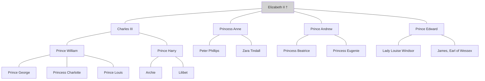

# British Royal Family Tree

```mermaid
graph TD
    Elizabeth[Elizabeth II †]---Charles[Charles III]
    Elizabeth---Anne[Princess Anne]
    Elizabeth---Andrew[Prince Andrew]
    Elizabeth---Edward[Prince Edward]
    
    Charles---William[Prince William]
    Charles---Harry[Prince Harry]
    
    William---George[Prince George]
    William---Charlotte[Princess Charlotte]
    William---Louis[Prince Louis]
    
    Harry---Archie[Archie]
    Harry---Lilibet[Lilibet]
    
    Anne---Peter[Peter Phillips]
    Anne---Zara[Zara Tindall]
    
    Andrew---Beatrice[Princess Beatrice]
    Andrew---Eugenie[Princess Eugenie]
    
    Edward---Louise[Lady Louise Windsor]
    Edward---James[James, Earl of Wessex]

    classDef deceased fill:#D3D3D3
    class Elizabeth deceased
```